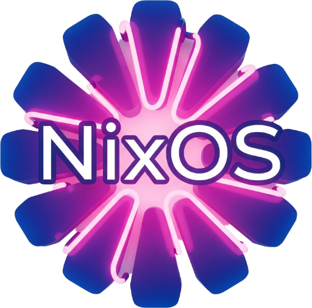

<div align="center">
 <br>
</div>

# bombonato/nix-config
NixOS Configuration

- NixOS Configuration with **Flakes** and **Home Manager** support
- **Modules** configuration (host and home) to enable specific or custom features
- Sensitive data in _external private repository_ (my-secrets) with soft and encryptation data (**sops-nix**).
- As reference, use the [my-secrets-template](https://github.com/bombonato/my-secrets-template) to create your own  private secrets repo.

## Links

### Info

- [Zero to Nix](https://zero-to-nix.com/)

##### Flakes

- [NixOS & Flakes Book](https://nixos-and-flakes.thiscute.world/)

##### Home Manager 

- [Home Manager - github](https://github.com/nix-community/home-manager)
- [Home Manager - Manual](https://nix-community.github.io/home-manager/)
- [Home Manager - Options](https://home-manager-options.extranix.com/)
- [Getting Started with Home Manager](https://nixos-and-flakes.thiscute.world/nixos-with-flakes/start-using-home-manager)

#### Package Repositories

- https://mynixos.com/
- https://search.nixos.org/packages
- https://home-manager-options.extranix.com/
- https://flakehub.com/
- https://www.nixhub.io/


## Structure

General structure for the nixos configuration

```
nix-config/
├── flake.nix
├── home/
│   ├── <username>/home.nix             # Main file, contains user data and imports the home modules
│   └── modules/
│       ├── browser.nix                 # Browser Configs: Chrome, Brave, etc
│       ├── git.nix                     # Git Configs
│       ├── shell.nix                   # Zsh, Aliases, Starship, Fish, shell related apps...
│       ├── ssh.nix                     # Specific user SSH config ...
│       ├── sops.nix                    # User Encryptation support config ...
│       └── desktop.nix                 # Main user desktop config
│
└── hosts/
    ├── <host_name>/configuration.nix   # Main file, inside import the host modules
    └── modules/
        ├── base.nix                    # Configs base (timezone, locale, etc)
        ├── soaps.nix                   # Host Encryptation support config ...
        ├── desktop.nix                 # Main host desktop config (GNOME, KDE, Deepin, ...)
        └── user.nix                    # Defines host user configs and creation process
```

## Commands

- Essentials commands to manage and build your nix/flake/home-manager files

```shell
# Nix-rules file formmater
$ nix fmt .
$ nixpkgs-fmt .


# Check all configurations
$ nix flake check --show-trace

# Flake build and switch
$ sudo nixos-rebuild switch --flake ~/nix-config

# Home Manager Switch
$ home-manager switch --flake ~/nix-config
```

### Secrets

```shell
# Update only the secrets repo
nix flake update my-secrets
nix flake lock --update-input my-secrets (deprecated)
```

### TODO

- Test other windows-manager: Hyprland, Cosmic, etc
- Study devenv

## References

Some of the inspirations used in this repository

- [Misterio77/nix-starter-config](https://github.com/Misterio77/nix-starter-configs)
- [Misterio77/nix-config](https://github.com/Misterio77/nix-config)
- [EmergentMind/nix-config](https://github.com/EmergentMind/nix-config)